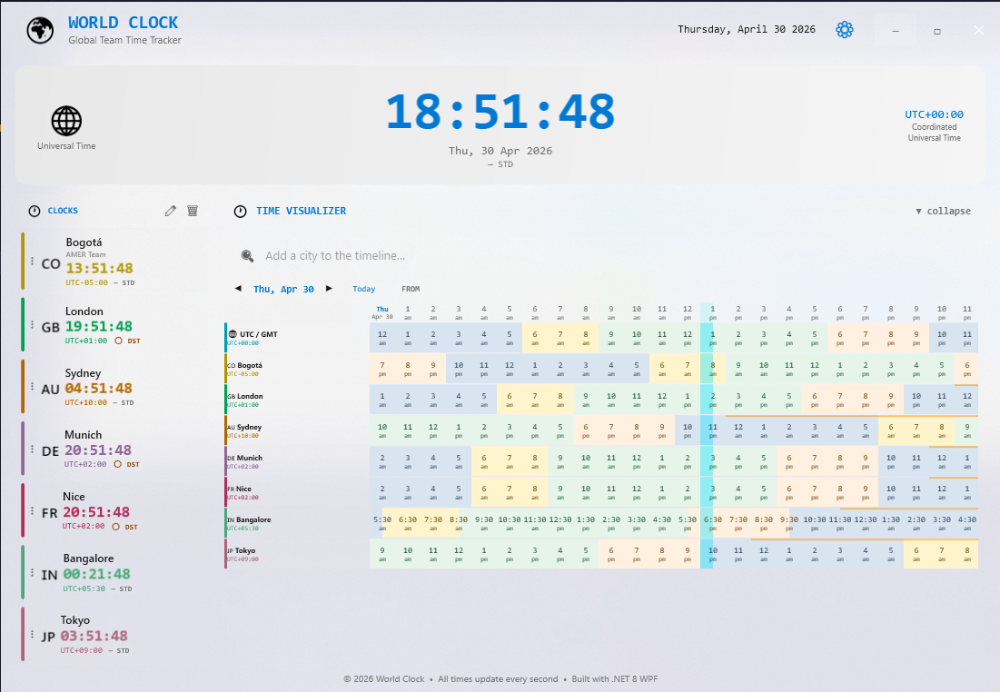

# WorldClock

A sleek, frameless Windows desktop clock built with **.NET 8 + WPF**. Track time across any number of cities simultaneously, visualise a full-day 24-hour timeline across all your timezones at a glance, and customise every detail — from accent colours to acrylic transparency.



---

## Features at a glance

| Feature | Description |
|---|---|
| **Multi-city clocks** | Live, ticking clocks for as many cities as you need, each with a unique accent colour |
| **Home location** | Mark one city as home — all other cards show their time difference relative to it |
| **Time Visualizer** | WTB-style 24-hour grid that shows the full day (00:00 – 23:30) across every timezone simultaneously |
| **+1 day detection** | The visualizer automatically highlights cells that belong to the next calendar day in orange |
| **City search backed by airports** | Thousands of cities searchable by name, country, or IATA code |
| **11 built-in themes** | Dark Default, Light Default, One Dark, Monokai, Solarized, Nord Dark, Tokyo Night, Catppuccin Mocha/Latte, Ariake Dark, and more |
| **Acrylic / transparency** | Live opacity slider — see your desktop through the window |
| **Edit & Delete mode** | Always-visible mini-settings icons in the clock panel header |
| **Stateful** | All cities, home location, theme, and opacity persist across restarts |

---

## Prerequisites

- **Windows 10 / 11** (WPF + Windows acrylic APIs)
- **.NET 8 SDK** — [download](https://dotnet.microsoft.com/download/dotnet/8.0)

---

## Getting started

```powershell
# 1. Clone
git clone https://github.com/your-org/worldclock.git
cd worldclock

# 2. Build
dotnet build WorldClock/WorldClock.csproj -c Release

# 3. Run
dotnet run --project WorldClock/WorldClock.csproj -c Release
```

The window is frameless — drag anywhere to move it. Use the **⚙** gear icon to open Settings.

---

## City database — powered by airport data


The city catalogue is derived from a **global airports dataset** (IATA / ICAO codes, timezone, GPS coordinates) published on [Kaggle by samvelkoch](https://www.kaggle.com/datasets/samvelkoch/global-airports-iata-icao-timezone-geo).

Because every commercial airport has an authoritative IANA timezone assignment, airports make an excellent proxy for "cities with known timezones". The Python pipeline at [`WorldClock/citiesdb/generate_world_cities_timezones.py`](WorldClock/citiesdb/generate_world_cities_timezones.py) downloads the raw dataset, deduplicates by city, resolves DST-safe UTC offsets, and writes `world_cities_timezones.csv`.

> **Tip:** You can search by city name *or* by IATA code. Typing `BOG`, `LAX`, or `NRT` jumps straight to Bogotá, Los Angeles, or Tokyo Narita.

---

## Tips & tricks

### Setting a home location
Right-click (or use edit mode) on any clock card and choose **Set as Home**. The home card gains a highlighted border and all other cards show a `+Xh / -Xh` badge relative to it. The Time Visualizer also re-anchors its column headers to your home timezone.

### Time Visualizer — reading the grid
- Each column is a **30-minute slot** (48 columns = full 24 hours).
- **Orange vertical bar** on a cell means that slot crosses midnight into the **next day** (`+1d` shown on the row header).
- Click any slot to pin the selection marker and see translated times for all cities in the result panel below.

### Switching themes
Open **Settings → Appearance** and pick from 11 curated themes. Changes apply live — no restart needed.

### Transparency / acrylic
Drag the **Opacity** slider in Settings. At low values the window blurs the desktop behind it using Windows acrylic composition.

### Keyboard-friendly window management
The window has no title bar. **Double-click** anywhere on the background to toggle maximise. **Right-click** the header area for a context menu with Minimise / Close options.

---

## Project structure

```
worldclock/
├── WorldClock/                  # Main WPF application
│   ├── Data/                    # City search & airport CSV loader
│   ├── Helpers/                 # Converters, theme helpers
│   ├── Models/                  # ClockLocation, AppTheme, TimeGrid*
│   ├── Services/                # ThemeService, SettingsService
│   ├── ViewModels/              # MainViewModel, TimeTranslatorViewModel
│   ├── citiesdb/                # Python pipeline to regenerate the city CSV
│   ├── MainWindow.xaml/.cs      # Shell window
│   └── SettingsWindow.xaml/.cs  # Settings panel
├── WorldClock.Tests/            # xUnit test suite (205 tests)
├── Features/                    # Gherkin feature files (living spec)
├── images/                      # Screenshots and reference images
└── README.md
```

---

## Running the tests

```powershell
dotnet test WorldClock.Tests/WorldClock.Tests.csproj --filter "Category!=UI"
```

205 unit and integration tests covering view-models, settings persistence, city search, and time translation logic.

---

## Further reading

| Document | Contents |
|---|---|
| [docs/architecture.md](docs/architecture.md) | WPF design canvas, MVVM wiring, scale modes |
| [docs/city-database.md](docs/city-database.md) | Airport dataset pipeline, CSV schema, how to regenerate |
| [docs/themes.md](docs/themes.md) | All built-in themes with their accent colours |
| [docs/time-visualizer.md](docs/time-visualizer.md) | Time Visualizer deep-dive: grid model, selection, +1d logic |
