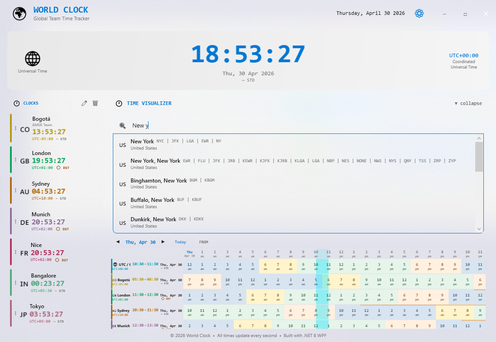

# City Database

WorldClock's city catalogue is built from **real-world airport data**, giving every searchable location an authoritative IANA timezone — including correct DST transitions.



---

## Why airports?

Commercial airports are the most reliable source of "cities with known, maintained timezones":

- Every major airport has an **IATA code** (e.g. `LAX`, `NRT`, `BOG`) that doubles as a memorable city abbreviation.
- Airport timezone assignments are kept up-to-date by aviation authorities, making them more reliable than general geographic databases for DST edge cases.
- The IATA city code (`City_IATA`) groups multiple airports in the same metro area (e.g. `NYC` covers JFK, LGA, and EWR) so the catalogue doesn't balloon with duplicates.

---

## Data source

| Property | Value |
|---|---|
| **Dataset** | `samvelkoch/global-airports-iata-icao-timezone-geo` |
| **Platform** | [Kaggle](https://www.kaggle.com/datasets/samvelkoch/global-airports-iata-icao-timezone-geo) |
| **License** | See dataset page |
| **Timezone format** | IANA (e.g. `America/New_York`, `Asia/Tokyo`) |

---

## Pipeline

The Python script [`WorldClock/citiesdb/generate_world_cities_timezones.py`](../WorldClock/citiesdb/generate_world_cities_timezones.py) (requires Python ≥ 3.9) downloads, processes, and exports the data:

```
Raw airport CSV (Kaggle)
   └── deduplicate by City_IATA
         └── resolve DST-safe UTC offset via zoneinfo
               └── world_cities_timezones.csv
```

### Running the pipeline

```bash
# Install the Kaggle CLI and configure credentials (~/.kaggle/kaggle.json)
pip install kaggle

cd WorldClock/citiesdb
python generate_world_cities_timezones.py
```

The output file `world_cities_timezones.csv` is placed next to the script. Copy it to `WorldClock/citiesdb/` (it is already excluded from the build via the `.csproj` `<Compile Remove>` directive) — the app loads it at runtime from the same directory as the executable.

---

## CSV schema

The generated CSV has a header row. Columns (0-based):

| # | Column | Example |
|---|---|---|
| 0 | `AirportName` | `John F Kennedy International` |
| 1 | `IATA` | `JFK` |
| 2 | `ICAO` | `KJFK` |
| 3 | `TimeZone` | `America/New_York` |
| 4 | `City_Name` | `New York` |
| 5 | `City_IATA` | `NYC` |
| 6 | `UTC_Offset_Hours` | `-5.0` |
| 7 | `UTC_Offset_Seconds` | `-18000.0` |
| 8 | `Country_CodeA2` | `US` |
| 9 | `Country_CodeA3` | `USA` |
| 10 | `Country_Name` | `United States` |
| 11 | `GeoPointLat` | `40.6413` |
| 12 | `GeoPointLong` | `-73.7781` |

---

## In-app search

`WorldCitySearchService` merges the CSV cities with the hand-curated `CityDatabase.All` list (covering the most common global cities out of the box). The merged, deduplicated list supports three match strategies:

### Built-in UTC entry

`CityDatabase.All` includes a dedicated UTC entry at the top of its list:

```
Display name : "UTC — Coordinated Universal Time"
IANA timezone: UTC
Search codes : UTC, Z, UCT
Flag emoji   : 🌐
```

This means the UTC clock card is always searchable in the city picker, and its label, accent colour, and team label can be customised and will persist across restarts just like any other city card. The UTC card cannot be deleted.

1. **Prefix match** on `City_Name` or `Country_Name` — highest priority.
2. **Substring match** — for partial or mid-word queries.
3. **IATA / code match** — typing `BOG`, `CDG`, or `SYD` returns Bogotá, Paris CDG, or Sydney instantly.

Results are ranked so prefix matches appear before substring matches, and city name matches before country matches.

---

## Curated fallback

Even without the CSV, the app ships with a built-in list (`CityDatabase.cs`) covering ~100 of the most-used cities across all regions — enough for a typical multi-timezone team setup. The CSV extends this to thousands of additional airports and cities worldwide.
