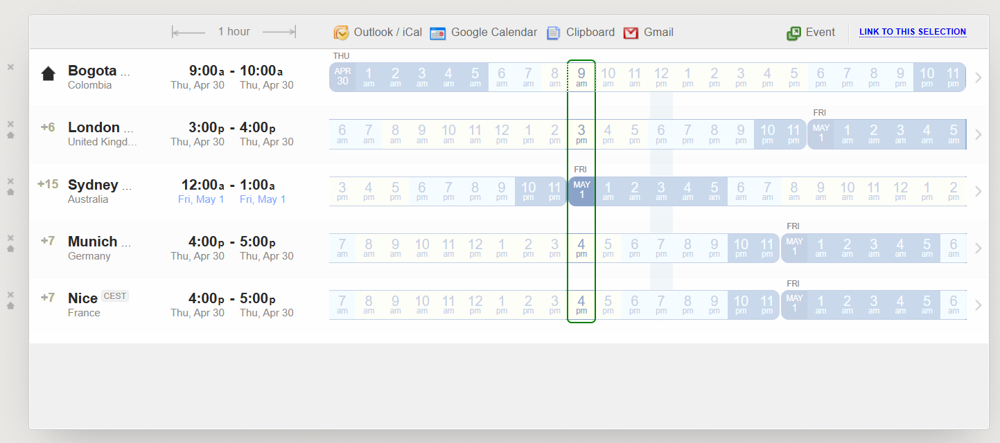

# Time Visualizer

The **Time Visualizer** is the right-hand panel of WorldClock. It renders a WTB-style 24-hour grid that makes it instantly clear which working hours overlap across your configured timezones.



---

## What you see

```
┌─────────────────────────────────────────────────────────────────────┐
│  Column headers  │ 12a │ 1a │ 2a │ … │ 12p │ 1p │ … │ 11p │        │
├──────────────────┼─────────────────────────────────────────────────-┤
│  New York   🏠   │ ░░░ │ ░░░│    │   │▓▓▓▓│    │   │     │        │
│  London          │     │    │    │   │     │▓▓▓▓│   │     │        │
│  Tokyo           │▓▓▓▓│    │    │   │     │    │   │     │+1d     │
└──────────────────┴─────────────────────────────────────────────────-┘
```

- **48 columns** — one per 30-minute slot (00:00 → 23:30), each 14 px wide.
- **One row per configured city**, home location first.
- **Colour bands** indicate time-of-day (Night → Early Morning → Morning → Day → Evening → Night).
- **Orange vertical bar** marks cells that belong to the *next* calendar day relative to home (`+1d` shown on the row header).
- **Column headers** anchor to the home location's timezone. A midnight boundary shows the weekday and short date (`Wed · May 1`).

---

## Grid model

### `TimeGridColumn`

Represents one column header (one 30-minute slot, index 0–47).

| Property | Description |
|---|---|
| `SlotIndex` | 0-based position (0 = 00:00, 47 = 23:30) |
| `SlotLabel` | Time label, e.g. `"12a"`, `"3p"` — empty for midnight |
| `IsHourStart` | True when slot is on the hour |
| `IsMidnight` | True for the 00:00 boundary; shows weekday + date instead of a time label |
| `DayOfWeekLabel` | e.g. `"Wed"` — non-empty only for midnight columns |
| `DateShortLabel` | e.g. `"May 1"` — non-empty only for midnight columns |

### `TimeGridCell`

Represents one cell (city × slot).

| Property | Description |
|---|---|
| `SlotIndex` | Column position |
| `TimeStr` | Local time for this slot in this city's timezone |
| `DayDiff` | `"+1"` when the cell is in the next calendar day; empty otherwise |
| `Band` | `TimeBand` enum (Night / EarlyMorning / Morning / Day / Evening) |
| `Background` | Theme-aware brush derived from `Band` |
| `IsSelected` | True when this cell falls within the selection range |

### `TimeGridRow`

One row = one city. Contains `CityName`, `UtcOffsetLabel`, `IsHome`, and an `ObservableCollection<TimeGridCell>` with 48 cells.

---

## Home location anchoring

When a home location is set, the column headers are calculated in the **home timezone** rather than UTC. This means:

- `00:00` in the header is midnight *in the home city*.
- Day-change detection is home-relative: a cell is `+1d` if the local date in that city is one day ahead of the home city's date for the same slot.
- Negative day differences (`-1d`) are intentionally suppressed — the grid always starts at home midnight and looks forward.

---

## Interacting with the grid

### Clicking a slot

Click any cell to move the **selection marker** to that slot. The result panel below the grid shows the translated local time for every configured city at that exact moment.

### Date navigation

Use the **◀ / ▶** arrow buttons to step back or forward one day. The **Today** button resets to the current date with the selection marker at the current hour.

### Source zone

The **city search box** above the grid lets you change which timezone drives the `Hour`/`Minute` picker in the legacy translation panel (independent from the visual grid).

---

## +1 day logic

Day-diff computation:

```csharp
var homeDate  = TimeZoneInfo.ConvertTime(slotUtc, _homeZone).Date;
var localDate = TimeZoneInfo.ConvertTime(slotUtc, cityZone).Date;
int dayDiff   = (localDate - homeDate).Days;
string diffStr = dayDiff > 0 ? $"+{dayDiff}" : "";
```

- If the city date is ahead of the home date, cells are tagged `+1` and rendered with an orange left-border bar.
- If behind, the difference is suppressed (no `-1d` clutter).

---

## Colour bands

| Band | Approximate range | Colour (Dark Default) |
|---|---|---|
| Night | 00:00 – 05:30 | Dark indigo `#1A1A3A` |
| Early Morning | 06:00 – 07:30 | Deep teal `#0D2D2D` |
| Morning | 08:00 – 11:30 | Dark green `#0D2D1A` |
| Day | 12:00 – 17:30 | Dark navy `#0D1A2D` |
| Evening | 18:00 – 21:30 | Dark mauve `#2D1A2D` |
| Night (late) | 22:00 – 23:30 | Dark indigo (same as Night) |

Exact colours adapt per theme via `TimeGridCell.Background`.
